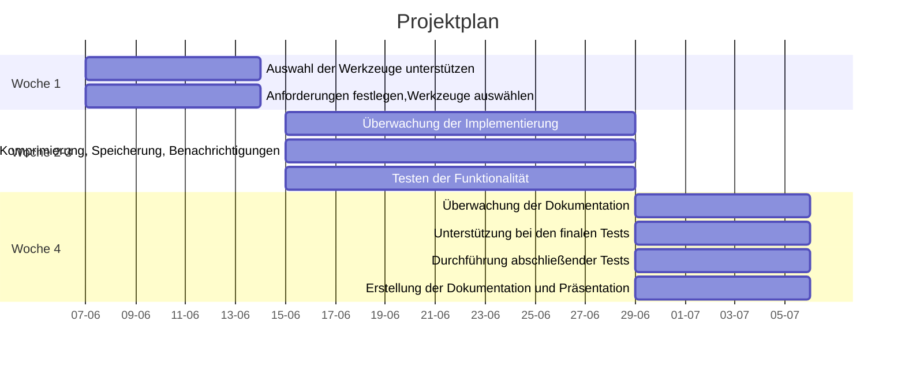

# Projektplan

## 1. Planung und Konzeption (Woche 1)

### Ziel
Grundlegende Planung und Festlegung der Anforderungen.

### Aufgaben
- **Anforderungen festlegen**: Sammeln und Dokumentieren der Anforderungen an die Lösung.
- **Werkzeuge auswählen**: Entscheidung über die zu verwendenden Tools und Technologien (z.B. Python, Bash, mysqldump, gzip, scp/sftp, sendmail/smtplib).

## 2. Implementierung der Lösung (Woche 2-3)

### Ziel
Entwicklung und Testen des automatisierten Backup-Skripts.

### Aufgaben
- **Skripterstellung**: Schreiben eines Skripts zur automatisierten Sicherung der MySQL-Datenbanken.
- **Komprimierung**: Integration von gzip zur Komprimierung der Sicherungen.
- **Speicherung**: Einrichtung der Übertragungsmethode (scp/sftp) zur Sicherung auf einem Cloud-Server.
- **Benachrichtigungen**: Implementierung des E-Mail-Benachrichtigungssystems.
- **Testen**: Durchführung von Tests, um sicherzustellen, dass alle Komponenten korrekt funktionieren.

## 3. Dokumentation und Abschluss (Woche 4)

### Ziel
Erstellung der Dokumentation und Vorbereitung der Präsentation.

### Aufgaben
- **Technische Dokumentation**: Erstellung einer umfassenden Anleitung zur Installation, Konfiguration und Wartung der Lösung.
- **Managergerechte Dokumentation**: Erstellung einer verständlichen Dokumentation für nicht-technische Stakeholder.
- **Finale Tests**: Durchführung abschliessender Tests zur Validierung der Lösung.
- **Präsentationsvorbereitung**: Erstellung der Präsentation für die Abschlussvorstellung des Projekts.


[Diagramm anzeigen](https://viewer.diagrams.net/?tags=%7B%7D&highlight=0000ff&edit=_blank&layers=1&nav=1&title=Unbenanntes%20Diagramm.drawio#R7Vxtk9o2EP41zLQfLoPf4ePBXZJO0plML23SfukIW9gKwiK2CHC%2FvpItAbbkF44XE64zNwOSbFnsPrv7rFa%2BnjWer98lYBH9TgKIe2Y%2FWPesh55pGn17wD54zybvGbiiI0xQIC7adTyhZyjvFL1LFMC0cCElBFO0KHb6JI6hTwt9IEnIqnjZlODiUxcghErHkw%2Bw2vsFBTQSvUa%2Fvxt4D1EYiUcPHDEwAf4sTMgyFs%2BLSQzzkTmQ04hL0wgEZLXXZT32rHFCCM2%2FzddjiLlYpcTy%2B95WjG6XnMCYtrnB86DrD72pMXQDMBhYd2KGHwAvhRg%2BJeQbnNEFBvEyDtnYE5zDlMIEJBOIKOv4uPQB%2B7hH8PkZiN9FN1KM6QrN2b2sNYroHLNOg331I4SDj2BDlnydKWUik60RayVU4IGt3xplsoR8yby1lRlvYDCBeLQV%2BJhgkrChTOR8poTMttrjz52SmL4Fc4Q5KP%2BCSQBiILrFEwesCTAKY%2FbdZ2KEbL6RKlcpKJhQuN7rEnJ%2BB8kc0mTDLhGjnlC5sAZbNFc7aG0BFO2hypUXAgHncDvzTq%2Fsi1BtSzWbipq%2FED%2BCcc90wXzBfnA8SRfb392oTUVjqrwqkdYsQCExU5WY4eokZp5AYvDr9%2BGd%2BeeHh%2BfN6v0%2F8ebf6fdQYxyKfGAc3HPfs8PgnpiKOM7vhYHihWqEZuoltCcSHYZkXwIxoOhH8Xk6KYknfCIopnsKKAs2JcvEh%2BKqfS8jb1yXgF01EYNPCKkyUaak7c98ud5UtL8qvdmn0psy0Zn1Zr1uvSmOrK3etm6xaqIz680wVD0xsT%2BJJkloREISA%2Fy46y0pa3fNR0IWQp%2FfIKUbEWbAkpKitpkWk81Xfv8bRzb%2FFtNljYd1obU5FhfsB2YKqZGEnV%2BXy7tOYn090Foj6Ki4ZuvZAOtSFVlU0ypCFD4tQCaEFcsDiiqpCPEvM7p1kQYIbA8dlRWYOlZwNlIw7ALs5wStTMCaUTvoErVymRrYmjJ0XDFwrb6Gz14WuYNKAdpXLz57cEHxKUtVmYlIk%2BcsnwxZyshXsv27ghyqghlcQU6lWuqNcQX5A5vcrqt6XVXhdpce11VQ3zNdTMX%2BSUGJ7vclkQN3aaaGe84nzMU6E6McZ99C%2FnkfT0kSwGQZh9kuRDbrJJHDU5hSDPeG2PrzZ%2BbjNe7KaHZX3e0oHeoirVrrtpqpUf%2BSAcb1XqFtV9hsCzrlVGj35MZducRjLLtfYdm9sdUbjicwWQE%2FyneQAx4gyyb%2B23yB4ZyJGmVe4MYMvQ2K2odxqwWVvKilO7qtmgMBZBwJoAcyW3L8MFsh%2F8eJA%2BCjpdLngo%2ByVNX1PMZ0hfwZ5kq%2BHupsmY3UeVu6vAx1djTbobcVXmUaWhtezZbh1XY7C6%2Fm%2BYjzF5jMnuEy5Fk7WKYr7i3v7QjfHFVuA5T21mxfGVW2dblVtfPb93j9F0eJimRSbrg4RX9naWSk2yswBjVCEk%2F7A%2FoUxCGGexopF5sM1cHqii3l%2BjjADDUxoHDEMZkqmjlBfcP2FGUZb1j7aZagBXt6StkkOYctVdPLnMV8U77mA5kvEjQvkuDdDbInXYBY6zd2h0%2Fu%2FNweuftAMaIIYK0HsZQ1PC0g8qMyDc8fWVxGgH7ILluZhgUAxtgSNhVFoUjst3ti22n3plAQz9BMi%2F5HOgcMp3yEIx75AN%2BL7jkKgjzMQeY7wQRLA1nwWleGEGfUcx74TCyy5f5VcAjurUoubIowLnW1srSD4s%2F2wFQB%2Fo7G2mwN%2FL1zcDLVGX3OjvxcEx9zrEY%2BZgwvyse8TsqeL%2BFVrsqr9AzTOZIy6evTZr%2BEdaOkkjPXp6VtafhY5o00blWTlp4svy25zQemlGjKedxoHCWtwgiYpH6EEUxTGGe5cZ%2Fba1rJAKuiSoM7%2FkmY4qE0qN4v20UadNFkWe9mVPah%2Bp3dsRgfgzRFfq%2FmZMwupSskdLv87oQpnabKod87Huq1cuajNxI2g6KHsqySNtsexSnvtZhlcnxmVzfoIiTBNaJf977voYm1dmDijU0HGJRx%2BlSndy61saB9%2BLCFN7hOFtJWDa0Ko2aXOtBu8NyWEnSHgq6sPO2op1Yuuh96PY5Lnuy5npKj3rC7UdiNRCdZc2tW8rFZ3HFKdl6hVb78EMDFqhT6NyXUV1xKZdV%2Bu79j9oka8reG16yGRcLtatI166LbQq5KDj5DP4pRmp%2B1LAn4mJy7lfxqFF%2B9Oem9aU6DZRHlMllwJ7GjhXuotatmrjts6SfcTgmvq2YdPz%2BmdcdoLovpTs7Cnh3TniZ1OGjP5zKYlsu8KUwbXWPaUaVaxw5eVNiul8k2spf38hoL2eWyxM0Vsh3dG82iOCCrAFnljxO%2FvLDwdhnPuAEAjGh%2B1oRW1SfaVkbcloWR2rqFrsDBuicnL9f8UqrQjwvV8nHzotWy%2BK9tj%2BpcYT08IcIhHmCvNY5CtWK5ca6ph3s6Hn82Gn9rL6rI%2F6ly9u0DfWXE65cyirL%2FqyixnMr3uW7H%2BuwbXnFvwvaMBq1mrU%2BQeR%2BYFTwPVHVzwcNri4mKkHshpnZrW0qtdpDMlrrxzvQuOWvu%2FjFRboW7f%2FxkPf4H)


# Swimlane-Diagramm

## Woche 1
| Rolle           | Aufgaben                                                 |
|-----------------|----------------------------------------------------------|
| **Projektmanager** | Anforderungen festlegen, Werkzeuge auswählen              |
| **Entwickler**      | Auswahl der Werkzeuge unterstützen                        |

## Woche 2-3
| Rolle           | Aufgaben                                                             |
|-----------------|----------------------------------------------------------------------|
| **Projektmanager** | Überwachung der Implementierung                                       |
| **Entwickler**      | Skripterstellung, Komprimierung, Speicherung, Benachrichtigungen        |
| **Tester**         | Testen der Funktionalität (Komprimierung, Speicherung, Benachrichtigungen) |

## Woche 4
| Rolle           | Aufgaben                                                           |
|-----------------|--------------------------------------------------------------------|
| **Projektmanager** | Überwachung der Dokumentation                                       |
| **Entwickler**      | Unterstützung bei der finalen Tests                                |
| **Tester**         | Durchführung abschliessender Tests                                   |
| **Dokumentation**  | Erstellung der technischen und managergerechten Dokumentation sowie der Präsentation |

## Übersicht



# Netzwerk-Schema

Dieses Diagramm zeigt die Einrichtung einer lokalen MySQL-VM und das Backup auf einer AWS EC2-Instanz.

```mermaid
graph TD
    A[Lokaler Rechner]
    B[MySQL-VM]
    C[AWS EC2-Instanz]

    A -->|SSH| B
    B -->|SSH| C

    subgraph Lokale Umgebung
        A
        B
    end

    subgraph Cloud Umgebung
        C
    end

    B -->|Backup-Skript| C

    style A fill:#f9f,stroke:#333,stroke-width:4px
    style B fill:#bbf,stroke:#333,stroke-width:4px
    style C fill:#9f9,stroke:#333,stroke-width:4px
    
    D[Verfügbarkeitszone: us-east-1c]
    E[Sicherheitsgruppe: sg-013fa1d9c4263ff2a]

    C --> D
    C --> E
