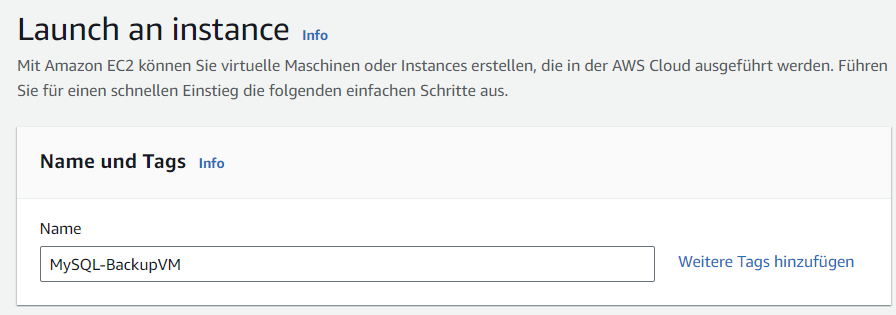
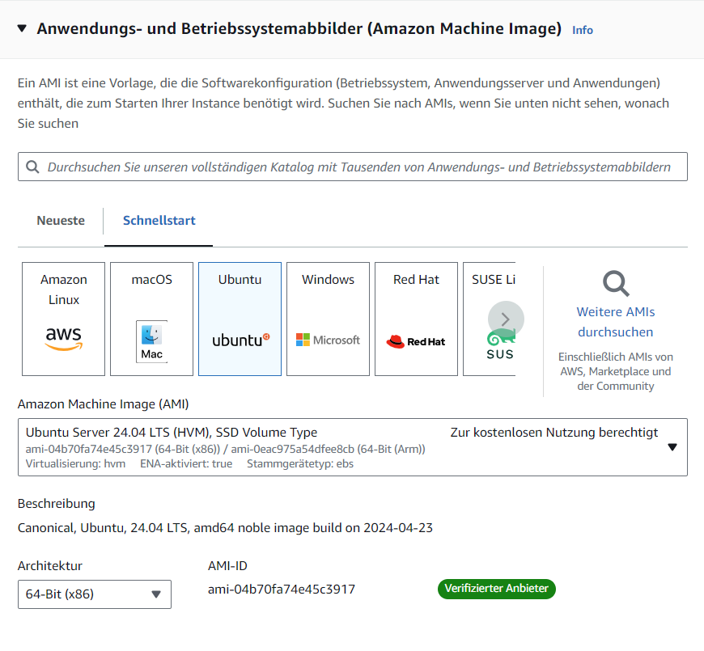

## Anleitung: Erstellen einer EC2-Instanz auf AWS

### Schritt 1: Anmeldung auf AWS
1. Öffnen Sie die Website: [AWS Academy](https://www.awsacademy.com/vforcesite/LMS_Login).
2. Melden Sie sich mit Ihren Zugangsdaten an.

### Schritt 2: Auswahl des EC2-Dienstes
1. Nach der Anmeldung sehen Sie das AWS Management Console Dashboard.
2. Wählen Sie den Service "EC2" aus, den wir für unsere Zwecke benötigen.

### Schritt 3: Erstellen einer VM
1. Im linken Navigationsmenü finden Sie unter "Instanzen" die Option "Instanzen".
2. Klicken Sie auf "Instanz starten" (Launch an instance), um eine neue VM zu erstellen.

### Schritt 4: Konfigurieren der Instanz
1. Geben Sie der VM einen Namen. Es ist wichtig, einen aussagekräftigen Namen zu wählen, damit Sie immer wissen, wofür die VM verwendet wird.

### Schritt 5: Betriebssystem auswählen
1. Unter dem Abschnitt "Anwendungs- und Betriebssystemabbilder (AMIs)" wählen Sie das gewünschte Betriebssystem aus. In diesem Fall wählen wir "Ubuntu Server 24.04".

### Schritt 6: Auswahl des Instanztyps
1. Wählen Sie den Instanztyp, der Ihren Anforderungen entspricht. AWS bietet verschiedene Instanztypen mit unterschiedlichen Leistungsmerkmalen (CPU, RAM, etc.).

### Schritt 7: Schlüsselpaar (Anmeldung)
1. Erstellen Sie ein neues Schlüsselpaar oder wählen Sie ein bestehendes aus, um den sicheren Zugriff auf Ihre Instanz zu ermöglichen. Laden Sie das Schlüsselpaar herunter und speichern Sie es sicher.

### Schritt 8: Netzwerkeinstellungen konfigurieren
1. Konfigurieren Sie die Netzwerkeinstellungen entsprechend Ihren Anforderungen. Dazu gehören die Auswahl des VPC, Subnetzes, sowie die Zuweisung einer öffentlichen IP-Adresse und die Konfiguration der Sicherheitsgruppen.

### Schritt 9: Zusätzliche Konfigurationen (optional)
1. Optional können Sie zusätzliche Speicheroptionen hinzufügen, Tags zur besseren Identifizierung der Instanz erstellen oder erweiterte Einstellungen konfigurieren.

### Schritt 10: Instanz starten
1. Überprüfen Sie Ihre Einstellungen und klicken Sie auf "Launch Instance", um die Instanz zu starten.

Nachdem die Instanz gestartet wurde, können Sie sich mit dem zuvor erstellten Schlüsselpaar über SSH verbinden und Ihre gewünschten Anwendungen und Daten auf die VM übertragen.
